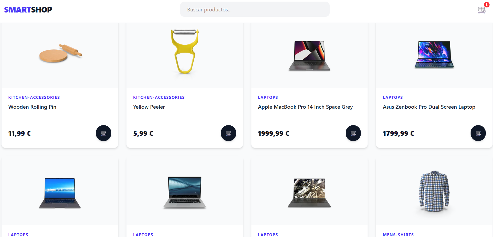
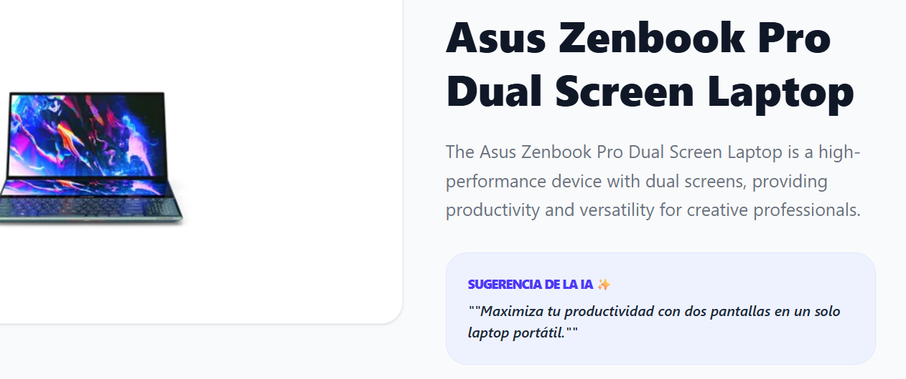

# 🛒 SmartShop - E-commerce Intelligence

<div align="center">

 


<br/>


</div>

## **SmartShop** es una plataforma de comercio electrónico de última generación que integra un asistente de Inteligencia Artificial para asesorar al usuario durante su compra. El proyecto se centra en la eficiencia, el diseño moderno y la persistencia de datos.

<div align="center">

### 🔗 [¡CLIC AQUÍ PARA VER LA DEMO EN VIVO EN VERCEL!](https://modern-ecommerce-react-ph12eex9c-christiamgsps-projects.vercel.app/)

_(Nota: Haz clic derecho y "Abrir en pestaña nueva" para no perder el repositorio)_

</div>

---

## 🛠️ Stack Tecnológico

He seleccionado un stack moderno para garantizar una experiencia de usuario fluida y un desarrollo escalable:

- **Core:** `React 18` + `Vite` para un rendimiento de carga instantáneo.
- **Estilos:** `Tailwind CSS` con un enfoque "Mobile First" y diseño totalmente responsive.
- **Navegación:** `React Router DOM` para gestionar rutas dinámicas de productos y navegación SPA.
- **Estado Global:** `Context API` para centralizar la lógica del carrito de compras.
- **IA:** `Groq SDK` + `Llama 3`, permitiendo consultas en lenguaje natural sobre el catálogo.
- **Feedback:** `Sonner` para notificaciones interactivas (Toasts) de éxito y error.
- **Iconografía:** `Lucide React` para una interfaz visual limpia y profesional.

---

## 🧠 Características y Lógica de React Aplicada

Este proyecto demuestra el dominio de conceptos clave en el ecosistema de React:

### 🤖 Asistente de IA (Smart Advisor)

Integración de un chatbot contextual que recibe la información del producto actual. Se configuraron **Variables de Entorno (`VITE_`)** en Vercel para asegurar una conexión privada y segura con la API de Groq Cloud.

### 💾 Persistencia de Datos (LocalStorage Custom Hook)

Desarrollo de un Hook personalizado `useLocalStorage` que automatiza la sincronización del carrito.

- **Sincronización:** Guarda automáticamente cada cambio (suma, resta o eliminación).
- **Recuperación:** Al recargar la página (`F5`), el estado se restaura desde el almacenamiento local, evitando que el usuario pierda su selección.

### ⚡ Optimización de UI (Skeletons)

Uso de componentes de carga (`SkeletonCard`) para mejorar el _Lighthouse score_ y reducir la percepción de espera del usuario mientras se obtienen los datos de la API de DummyJSON.

---

## 📂 Estructura de Carpetas

- `/src/components`: Componentes atómicos (Navbar, ProductCard, IAAssistant).
- `/src/context`: Manejo del estado global con `CartContext`.
- `/src/hooks`: Lógica extraída como `useLocalStorage`.
- `/src/pages`: Vistas de la aplicación (Home, Carrito, Detalle, 404).
- `/src/assets`: Recursos estáticos y capturas de pantalla.

---

## 🚀 Instalación Local

1.  Clona el repositorio.
2.  Instala las dependencias:
    ```bash
    npm install
    ```
3.  Crea un archivo `.env` en la raíz con tu clave:
    ```env
    VITE_GROQ_API_KEY=tu_clave_aqui
    ```
4.  Ejecuta el proyecto:
    ```bash
    npm run dev
    ```

---

Desarrollado con ♥️ por <span> Christiam Silva </span> - 2026 🚀
